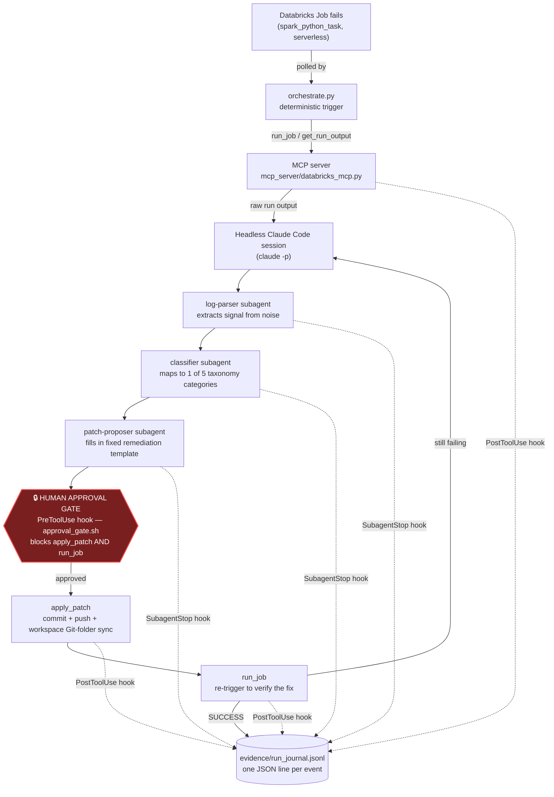

# Self-Healing Data Pipeline: Diagnostic Multi-Agent System for Databricks

A constrained, auditable diagnose-and-remediate loop for Databricks PySpark job failures, built on Claude Code's subagents, hooks, and MCP tooling. When a registered job fails, a deterministic trigger (`orchestrate.py`) pulls the raw run output and hands it to a fixed three-agent chain — **log-parser → classifier → patch-proposer** — that reduces the log to its relevant signal, maps it to one of five known failure categories, and fills in that category's templated remediation using specifics pulled from the log. Nothing is applied automatically: every patch and every job re-trigger is blocked behind a human approval gate (a Claude Code `PreToolUse` hook), and every step of the chain — every tool call result and every subagent completion — is appended to `evidence/run_journal.jsonl` for after-the-fact audit. This is deliberately **not** a free-form autonomous fixer; it exists to demonstrate a narrow, evidence-producing diagnostic loop where an LLM proposes and a human disposes.

This repo is a portfolio project. Its credibility rests on the real bugs found and real evidence captured while building it (see [Design decisions worth calling out](#design-decisions-worth-calling-out) and [How it works](#how-it-works)), not on a claim that the system is flawless — two of five broken scenarios are diagnosed-but-not-yet-fixed, and the richest example below took two full diagnostic passes because the first proposed patch was itself wrong.

## Architecture



The human-approval step is the key design decision in this project: `orchestrate.py` never calls `apply_patch` or `run_job` itself (it's a headless session, so there's no human present to answer a prompt — it hard-blocks both tools via `--disallowedTools` as belt-and-suspenders alongside the hook). Applying a patch and re-verifying it are always separate, manual, human-approved steps performed afterward. See [Design decisions](#design-decisions-worth-calling-out) for why this matters concretely, not just in principle.

## Failure taxonomy

Pulled directly from `CLAUDE.md` §2, unmodified:

| Category | Log Signature to Detect | Template Remediation |
|---|---|---|
| `schema_drift` | `AnalysisException` / column not found / type mismatch on read | Add explicit schema or `mergeSchema` option |
| `null_violation` | NOT NULL constraint violated / null in non-nullable write | `.na.drop()` or `.fillna()` on the offending column |
| `oom` | Exit code 137 (SIGKILL) with no Python traceback, "Execution ran out of memory" platform message, OR `OutOfMemoryError` / executor lost / spill warnings if triggered at the Spark level | Repartition or convert join to broadcast |
| `bad_join` | Row explosion / duplicate keys / Cartesian product | Validate join key uniqueness, switch join type |
| `type_mismatch` | Cannot resolve / implicit cast error | Explicit `.cast()` on offending column |

Unlike the other four categories, `oom` failures may appear as a platform-level process kill (exit code, no stack trace) rather than a Python/Spark exception — this matters for how the log-parser agent handles it (see [Limitations](#limitations)).

## How it works

The `type_mismatch` scenario has the richest evidence trail of the five — two full diagnostic rounds, a genuinely wrong first patch, and a corrected second patch that actually fixed it — so it's used here as a real incident walkthrough rather than a hypothetical.

**The scenario:** `pipelines/broken_scenarios/type_mismatch.py` computes a flag column comparing `o_totalprice` (`DECIMAL(18,2)`) directly against `o_orderdate` (`DATE`) with no cast, on the job `self-healing-type-mismatch`.

### Round 1 — detection and a wrong first patch

The original failure (captured in `evidence/logs/type_mismatch_before.txt`, commit `85bcd6a`):

```
[DATATYPE_MISMATCH.BINARY_OP_DIFF_TYPES] Cannot resolve "(o_totalprice = o_orderdate)" due to
data type mismatch: the left and right operands of the binary operator have incompatible types
("DECIMAL(18,2)" and "DATE"). SQLSTATE: 42K09
...
File .../type_mismatch.py:37
     35 flagged = orders.withColumn(
     36     "price_equals_order_date",
     37     F.col("o_totalprice") == F.col("o_orderdate"),
     38 )
```

**log-parser's excerpt** (from `evidence/run_journal.jsonl`, `2026-09-16T19:52:56Z`):

```
Error type / exit signal: AnalysisException (DATATYPE_MISMATCH.BINARY_OP_DIFF_TYPES)
Error message: Cannot resolve "(o_totalprice = o_orderdate)" due to data type mismatch: the left
and right operands of the binary operator have incompatible types ("DECIMAL(18,2)" and "DATE").
Identifiers mentioned: table self_healing_demo.pipeline.orders_raw, columns o_totalprice
(DECIMAL(18,2)), o_orderdate (DATE), o_custkey, o_orderkey, derived column price_equals_order_date
```

**classifier** (`19:53:07Z`): `Classification: type_mismatch` — `Matched signature: Cannot resolve / implicit cast error`

**patch-proposer's first patch** (`19:53:21Z`):

```diff
- flagged = orders.withColumn("price_equals_order_date", F.col("o_totalprice") == F.col("o_orderdate"))
+ flagged = orders.withColumn("price_equals_order_date", F.col("o_totalprice") == F.col("o_orderdate").cast("decimal(18,2)"))
```
> Rationale: matches the type_mismatch signature (DATATYPE_MISMATCH.BINARY_OP_DIFF_TYPES comparing DECIMAL(18,2) and DATE), remediated by explicitly casting o_orderdate to decimal(18,2) so the comparison operands agree.

This was applied via `apply_patch` (commit `794eb6e`, `20:28:21Z`) and re-verified via `run_job` (`20:36:19Z`) — **and it failed again**, with a different error (run_id `331698409850578`):

```
[DATATYPE_MISMATCH.CAST_WITH_FUNC_SUGGESTION] Cannot resolve "CAST(o_orderdate AS DECIMAL(18,2))"
due to data type mismatch: cannot cast "DATE" to "DECIMAL(18,2)".
To convert values from "DATE" to "DECIMAL(18,2)", you can use the functions `UNIX_DATE` instead.
```

Spark has no direct `DATE → DECIMAL` cast path at all — the first patch was syntactically valid PySpark that nonetheless failed at plan-analysis time. The template ("explicit `.cast()`") was correctly selected; the specific cast target chosen from the log's identifiers was not.

### Round 2 — re-diagnosing the second failure

Rather than hand-patching the obvious fix, the new failure was run back through the full chain from scratch:

**log-parser** (`20:37:54Z`) re-extracted the new signature (`CAST_WITH_FUNC_SUGGESTION`, pointing at the same `type_mismatch.py:37`). **classifier** (`20:38:08Z`) re-confirmed `type_mismatch` / `Cannot resolve / implicit cast error`. **patch-proposer** (`20:38:36Z`), seeing the new error and the platform's own `UNIX_DATE` suggestion, proposed a corrected patch:

```diff
- F.col("o_totalprice") == F.col("o_orderdate").cast("decimal(18,2)"),
+ F.col("o_totalprice") == F.col("o_orderdate").cast("timestamp").cast("long").cast("decimal(18,2)"),
```
> Rationale: matches the type_mismatch signature (DATATYPE_MISMATCH.CAST_WITH_FUNC_SUGGESTION on direct DATE->DECIMAL cast), remediated by chaining explicit .cast() calls through DATE -> TIMESTAMP -> LONG -> DECIMAL(18,2), a Spark-supported cast path, instead of the unsupported direct DATE->DECIMAL cast attempted in the prior patch.

This stays within the fixed `type_mismatch` template (still "explicit `.cast()` on the offending column") rather than reaching for the platform-suggested `UNIX_DATE` function — a deliberate choice to chain three `.cast()` calls (DATE → TIMESTAMP → LONG → DECIMAL, i.e. epoch seconds) instead of introducing a new function outside the template's scope.

### Verified fix

Applied via `apply_patch` (commit `689b0b0`, `21:09:34Z`), re-verified via `run_job` (`21:11:37Z`, run_id `182106144832444`, job_run_id `239715506247208`): **`state: SUCCESS`**. `get_run_output` on the successful run returns no error text — captured as-is in `evidence/logs/type_mismatch_after.txt`, including run metadata, since this script (unlike `bad_join.py`) prints no stdout diagnostics of its own.

## Evidence

| Category | Job name | Before | After | Status |
|---|---|---|---|---|
| `schema_drift` | `self-healing-schema-drift` | [`schema_drift_before.txt`](evidence/logs/schema_drift_before.txt) | — | Evidence captured. An early patch (commit `adc19f7`, applied **before** the approval gate existed) turned the `AnalysisException` into an explicit `assert`, but never addressed the missing column — the job still fails today. See [Design decisions](#design-decisions-worth-calling-out). |
| `null_violation` | `self-healing-null-violation` | [`null_violation_before.txt`](evidence/logs/null_violation_before.txt) | — | Evidence captured, not live-applied. |
| `oom` | `self-healing-oom` | [`oom_before.txt`](evidence/logs/oom_before.txt) | — | Evidence captured, not live-applied. Failure signature is environment-dependent — see [Limitations](#limitations). |
| `bad_join` | `self-healing-bad-join` | [`bad_join_before.txt`](evidence/logs/bad_join_before.txt) | [`bad_join_after.txt`](evidence/logs/bad_join_after.txt) | **Fixed live**, one diagnostic pass (commit `7cd60b9`). |
| `type_mismatch` | `self-healing-type-mismatch` | [`type_mismatch_before.txt`](evidence/logs/type_mismatch_before.txt) | [`type_mismatch_after.txt`](evidence/logs/type_mismatch_after.txt) | **Fixed live**, two diagnostic passes (commits `794eb6e` → `689b0b0`) — see walkthrough above. |

Full machine-readable trail for the `type_mismatch` runs: [`evidence/run_journal.jsonl`](evidence/run_journal.jsonl).

## Design decisions worth calling out

**1. Why `apply_patch`/`run_job` are gated behind human approval instead of auto-applied.** The `schema_drift` scenario is the concrete case for this, not just the abstract one. Its currently-applied "fix" (commit `adc19f7`) was pushed to the workspace *before* the approval gate existed (added later, commit `5c7ddf5`). It wraps the missing-column reference in `assert "o_customer_email" in orders.columns, ...` — which does make the failure clearer (an `AssertionError` with an explicit message instead of a `withColumn` resolving into an `AnalysisException`) but does **not** fix the schema drift: the column is still missing, and the job still fails, exactly as before. A patch that lands cleanly, commits, and pushes without erroring is not the same thing as a patch that resolves the failure — an unattended loop that treated "apply_patch succeeded" as "problem solved" would have been wrong here. To be clear about the timeline: the gate did not catch this patch — it couldn't have, since `adc19f7` predates `5c7ddf5` by two days and no approval step existed yet when it landed. It's cited here as the *motivating* case, not a caught one: this is the exact kind of silent non-fix that prompted adding the gate afterward, so that no future patch reaches `apply_patch`/`run_job` without a human confirming it actually resolves the failure rather than just relabeling it.

**2. classifier/patch-proposer output-format compliance, and why the fallback is deterministic extraction, not more prompting.** Commit `710ec38`: *"The classifier's content is correct across repeated tests but it won't hold a strict two-line output contract... Verified against 16 cases: 12 real classifier outputs from this session plus 4 synthetic formatting variants (bold/dash-separator/case/mid-paragraph placement)."* Both `classifier.md` and `patch-proposer.md` carry unusually long "Strict output contract" sections (explicit bans on preamble, markdown headers, "Reasoning:" sections, closing remarks) as a direct result of this — and the fix that shipped alongside it wasn't further prompt-tightening but a deterministic regex extraction (`parse_classification()`, matching `Classification|Category` labels after stripping markdown emphasis) so a downstream consumer never depends on the model self-constraining perfectly. `orchestrate.py` was later rewritten to not parse the chain's output at all (it just relays a headless session's printed output and stops), but the pattern is preserved as an explicit note in `patch-proposer.md`: *"If a future consumer needs a machine-parseable field from this output... extract it deterministically... rather than relying on this agent's self-formatting being perfect every time."*

**3. Found via live testing: `run_job` returned the wrong `run_id`.** Commit `8b95442`: `run_job()` originally returned the parent job-level `run_id` from the SDK's `run_now`/`get_run` response. `get_run_output` rejects that — the Jobs API only accepts a task-level `run_id`, and refuses on any run with multiple tasks (which a single-task job's parent run technically is). This *"broke the first end-to-end orchestrate.py run against a real job"* per the commit message. The fix makes `run_job` resolve `run.tasks[-1].run_id` the same way `list_runs` already did, returning both `run_id` (task-level, feed to `get_run_output`) and `job_run_id` (parent, for the run page URL) — not something that surfaced in design or review, only in actually running the tool against a live workspace.

## Tech stack

- **Databricks Free Edition** — Unity Catalog (`self_healing_demo.pipeline.*`), serverless job compute (no cluster spec attached to any task), Git folders for workspace/repo sync
- **Claude Code** — subagents (`log-parser`, `classifier`, `patch-proposer`, each with a `tools: Read`-only, strict-output-contract definition in `.claude/agents/`), hooks (`PreToolUse` approval gate, `PostToolUse`/`SubagentStop` evidence logging), and a project-local MCP server
- **Python** — `pyspark`, `pandas`, `databricks-sdk`, `python-dotenv`, `mcp` (FastMCP)
- **Custom MCP server** (`mcp_server/databricks_mcp.py`) — four tools (`list_runs`, `get_run_output`, `apply_patch`, `run_job`) that replace manual Databricks-UI copy/paste in the diagnose-and-remediate loop

## Limitations

- **Serverless-only compute.** Databricks Free Edition doesn't support attaching a classic cluster spec; every job in `job_ids.json` runs on serverless compute by default (`scripts/setup_databricks_jobs.py`). Behavior that depends on cluster-level configuration doesn't apply here.
- **`patch-proposer` is template-bound, not general-purpose codegen.** It fills in exactly one of five fixed remediation templates per category and refuses (`unclassified`, no best-guess) when the classifier doesn't produce a clean match. It cannot propose a fix outside those five shapes, by design — see `.claude/agents/patch-proposer.md`'s hard constraints.
- **The `oom` scenario's failure signature is environment-dependent.** `oom.py`'s own docstring notes that on a small demo table and Free Edition serverless compute specifically, the expected `OutOfMemoryError`/executor-lost signature may instead surface as a query timeout or a serverless resource-limit error — both are meant to be treated as the same `oom` category, but the log-parser/classifier chain hasn't been exercised live against every variant.
- **`apply_patch` pushes the whole current branch, not just its own commit.** It runs `git push origin <branch>` after committing — if other commits are already sitting on that branch ahead of what's been reviewed, they go along for the ride. It's scoped to a single-branch, single-contributor demo workflow, not a shared branch.

## Setup / reproduction

1. Create a [Databricks Free Edition](https://www.databricks.com/learn/free-edition) workspace and generate a personal access token (User Settings → Developer → Access tokens).
2. In the workspace, add a **Git folder** (Repos) pointing at your fork/clone of this repository. `mcp_server/databricks_mcp.py` and `scripts/setup_databricks_jobs.py` both hardcode a `GIT_FOLDER` workspace path (`/Workspace/Users/<your-email>/...`) — update it to match your own workspace path and username.
3. Clone this repo locally and create a `.env` file in the repo root:
   ```
   DATABRICKS_HOST=https://<your-workspace-host>
   DATABRICKS_TOKEN=<your-PAT>
   ```
4. `pip install -r requirements.txt`
5. `python scripts/setup_databricks_jobs.py` — idempotently registers `golden_job.py` plus the five `broken_scenarios/*.py` files as Databricks Jobs, and writes `job_ids.json` (gitignored — workspace-specific).
6. `.mcp.json` already registers `mcp_server/databricks_mcp.py` as a local stdio MCP server for Claude Code — run `claude` from the repo root and approve the MCP server when prompted.
7. Trigger a failing job end-to-end: `python orchestrate.py self-healing-type-mismatch` (or any other registered job name) — this runs the job, and on failure hands the raw output to a headless Claude Code session that runs log-parser → classifier → patch-proposer and prints the proposed patch, then stops.
8. Review the proposed patch, then interactively (inside a normal `claude` session in this repo) call `apply_patch` and `run_job` yourself to apply and re-verify it — you'll be prompted to approve each at the `PreToolUse` gate.

## Screenshots

_To be added:_
- Databricks Jobs list showing the six registered pipeline jobs
- A failed run's error page (e.g. the `type_mismatch` `AnalysisException`)
- The `PreToolUse` approval prompt blocking `apply_patch`/`run_job`
- An excerpt of `evidence/run_journal.jsonl` showing the diagnostic trail
